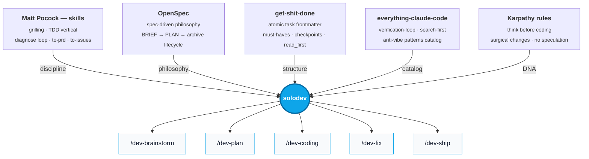

# solodev

> **Plan > Vibes.** Five Claude Code skills for solo devs who refuse to vibe-code and refuse enterprise ceremony.

```
/dev-brainstorm   →   /dev-plan   →   /dev-coding   →   /dev-ship
   BRIEF.md            PLAN.md         executes          verifies + closes
                                          │
                                       /dev-fix  (a bug appears, any time)
```

---

## The fusion

solodev is not a new framework. It's a **distillation** — four of the best dev-discipline projects for AI coding, compressed into five lean skills that fit one person shipping fast.



---

## Built for one person, not twenty

Most AI dev frameworks were written for **teams**: phases, sprints, epics, OKRs, sub-rituals, multi-agent orchestration, parallel execution waves, integration officers. You are not twenty people. You are one person shipping a feature this afternoon.

**solodev removes the ceremony.** What's left is the smallest set of disciplines that consistently prevents AI from making you regret asking it to code:

| You want | solodev gives you | We dropped |
|---|---|---|
| Stress-test the idea | `/dev-brainstorm` — 1 question at a time, with recommendation | Persona workshops, opportunity sizing |
| Plan that survives reset | `/dev-plan` — atomic tasks, verifiable acceptance, vertical slices | Phases, milestones, wave scheduling, parallel agent pools |
| Execute reliably | `/dev-coding` — TDD where it pays, delegates bugs and closeout | DAG orchestrators, multi-agent supervisors, agent boards |
| Kill bugs with method | `/dev-fix` — feedback loop first, falsifiable hypotheses, one probe each | Trial-and-error, "change it and see if it passes" |
| Ship what's verified | `/dev-ship` — Must-Haves, demo script, diff review, security pass | Release trains, change-advisory boards, sign-off matrices |

### The over-engineering tax (and why we refuse to pay it)

Solo devs lose more time to **planning theater** than to bad code. Symptoms you'll recognize:

- BRD → PRD → TDD → ADR → RFC → SDS for a CRUD endpoint
- 14-page spec where 2 paragraphs would land the same outcome
- "Phase 3 of 7" for a feature that could ship Friday
- Backlog grooming for a backlog you alone wrote yesterday
- A `must_haves` checklist with 30 items, of which 25 are obvious to anyone reading the code

**The 9 vs 10 rule:** a 9/10 implementation shipped today compounds. A 10/10 plan that ships in three weeks rots. Solo devs win on velocity, not polish. solodev biases every default toward the 9.

### What stayed

- **One question at a time** with a recommendation — never ten at once, never silent assumptions (Karpathy)
- **No code in the plan** — decisions, contracts, verifiable acceptance criteria; code lives in code
- **Vertical slices** — each task cuts schema → API → UI → test in a thin slice, not "all the models first"
- **Reset-friendly** — drop the session, read the `PLAN.md`, resume. Auto-sufficient on purpose.
- **Verify before done** — every acceptance criterion is grep/build/test-able; no "works correctly" allowed
- **Surgical changes** — touch what was asked; don't refactor adjacent code; don't add abstractions for hypothetical futures

### What we cut

- ❌ Phases, sprints, epics, OKRs (you have tasks and subtasks)
- ❌ Wave-based parallel execution (you're one person — there is no "wave 2")
- ❌ Multi-agent orchestration with shared state machines (overkill for solo)
- ❌ Goal trees with 30 must-have rows (3–5 verifiable truths is enough)
- ❌ SUMMARY chaining between adjacent plans (false dependencies)
- ❌ User-setup documents separated from the plan (just put it inline)
- ❌ Spec-kit-style rigid phase gates (iterate, don't waterfall)

---

## The five skills

### `/dev-brainstorm`

Structured grilling **before** you plan. Mirrors back what it understood (so a spoken, stream-of-consciousness idea doesn't get grilled in the wrong direction), triages the idea as S/M/L so a 30-minute task doesn't pay BRIEF tax, then asks one question at a time, always with a recommendation inline. Explores the codebase silently to answer what code can answer. Adds a product lens (empty/error/loading/permission states) and closes with a top-3 risk radar. Builds a one-page `BRIEF.md` live as decisions crystallize.

**Use when:** you have a raw idea and want to stress-test it before committing to a plan.

### `/dev-plan`

Transforms the `BRIEF.md` (or a finished discussion) into an atomic `PLAN.md`. Vertical slice tasks. Each task has: `type`, `effort`, `slice`, `depends_on`, `read_first`, `files_modified`, `action`, `acceptance` (verifiable), `must_pass`, and `rollback` (for tasks that touch migrations, public contracts, or prod data). Plus a Must-Haves block (truths, artifacts, key links) and a 60-second demo script that get verified at the end, and `/clear` points marked between noisy tasks. **No code in the plan.**

**Use when:** the BRIEF is closed and you want a reset-friendly execution document.

### `/dev-coding`

Executes the `PLAN.md` task-by-task. Opens each session with a progress line (`4/9 tasks ✅`). Reads `read_first` before touching anything. Runs `must_pass` and verifies every acceptance criterion. Supports TDD (vertical tracer bullets, never horizontal slicing), HITL checkpoints (`checkpoint:decision`, `checkpoint:human-verify`), a scope guard when a task balloons past its declared files, a drift protocol when reality contradicts the plan, and atomic commits per task. Delegates bugs to `/dev-fix` and closeout to `/dev-ship`.

**Use when:** you have a `PLAN.md` and want to execute it without losing discipline.

### `/dev-fix`

The diagnose loop as its own skill — no plan required. Triages a bug as trivial / real / architectural, then for real bugs runs the six-phase loop: build a sub-10-second reproducible feedback loop first, rank falsifiable hypotheses, one probe per hypothesis, fix with a regression test, clean up the probes. Stops and asks after two cycles without progress instead of guessing a third time.

**Use when:** something is broken — a stack trace, "it worked yesterday", or a failed `checkpoint:human-verify`.

### `/dev-ship`

Goal-backward verification before you call it done. Runs the full build/test/lint, the PLAN's Must-Haves, and the demo script; reviews the whole diff for leftovers (debug logs, dead code, empty catches) and author bugs; runs a security lens over touched files (hardcoded secrets, unvalidated external input, missing auth); writes `SUMMARY.md` and archives the plan. Also runs standalone as a disciplined pre-commit review.

**Use when:** the last task is done, or you want a diff reviewed before committing.

---

## Install

```bash
git clone https://github.com/calneymgp/solodev.git
cd solodev && ./install.sh             # global   → ~/.claude/skills/
# or
cd solodev && ./install.sh --project   # project  → ./.claude/skills/
```

Open any Claude Code session and type `/` — the five skills appear in autocomplete.

## Workflow

```
1. > /dev-brainstorm
   Mirrors the idea back, triages S/M/L, asks one question at a time
   with a recommendation. .plans/<feature>/BRIEF.md is written live.

2. > /dev-plan
   Reads BRIEF + your CLAUDE.md + codebase, writes PLAN.md.
   Atomic tasks, vertical slices, effort, rollback, must-haves, demo script.

3. > /clear  (optional — reset context)
   PLAN.md is auto-sufficient.

4. > /dev-coding
   Picks next pending task, reads read_first, applies action,
   verifies acceptance, marks [x], commits, moves on.
   → /dev-fix any time a bug appears.

5. > /dev-ship
   Build/test/lint + Must-Haves + demo + diff review + security pass.
   Writes SUMMARY.md. Done means verified, not "looks done".
```

Outputs live in:

```
.plans/<feature-slug>/
├── BRIEF.md          # /dev-brainstorm (optional)
├── PLAN.md           # /dev-plan       (source of truth)
├── DISCOVERY.md      # /dev-plan       (when library research was needed)
└── SUMMARY.md        # /dev-ship       (on completion)
```

---

## Origin & credits

solodev cherry-picks what compounds across four leading dev-discipline projects for AI coding agents — and drops what doesn't fit a solo dev.

- **[Matt Pocock — skills](https://github.com/mattpocock/skills)** — `grill-with-docs` taught the "one question at a time, with recommendation, explore-codebase-first" pattern. `tdd` taught vertical tracer bullets (never horizontal slicing). `diagnose` taught "build the feedback loop first — that IS the skill". `to-prd` and `to-issues` showed independently-grabbable vertical slices.

- **[OpenSpec (Fission-AI)](https://github.com/Fission-AI/OpenSpec)** — `proposal.md` → `tasks.md` → archive lifecycle. The "agree before you build" anti-vibe philosophy.

- **[get-shit-done (gsd-build)](https://github.com/gsd-build/get-shit-done)** — per-task frontmatter (`type`, `slice`, `depends_on`, `files_modified`, `read_first`, `must_pass`), checkpoint patterns, and Must-Haves (truths/artifacts/key_links) for goal-backward verification. solodev keeps the spirit, drops the enterprise weight.

- **[design.md (Google Labs)](https://github.com/google-labs-code/design.md)** — separate concern; not pulled in directly. Worth knowing about for UI-token-heavy work.

- **[everything-claude-code (affaan-m)](https://github.com/affaan-m/everything-claude-code)** — the comprehensive catalog that helped identify which patterns actually compound (search-first, verification-loop) vs. which are framework-bound noise.

### Karpathy's anti-LLM rules baked in

- **Think before coding** — surface ambiguity, never assume in silence
- **Surgical changes** — touch only what was asked
- **Goal-driven** — vague tasks → verifiable criteria before starting
- **No speculative engineering** — minimum code that solves the actual problem

---

## What this is NOT

- **Not a framework.** No CLI, no daemon, no state machine, no version pinning. Five markdown files Claude reads.
- **Not a methodology.** Skip `/dev-brainstorm` if the brief is already clear in your head. Skip Must-Haves on a 30-line script. Use it where it pays.
- **Not for teams.** Ten PMs + thirty engineers? Use full GSD or OpenSpec. solodev is the lean version for one person.
- **Not anti-AI.** It's pro-AI — by removing the "vibe" failure mode that makes AI coding unreliable for solo devs.

---

## Contributing

Open an issue if a pattern bites you in real solo-dev usage. Improvements should make the skills **shorter** and **sharper**, not longer.

PRs welcome if they reduce ceremony without sacrificing discipline.

## License

MIT — see [LICENSE](LICENSE). If you fork: keep the credits. The four upstream projects deserve the visibility.
